# gitlab-cicd-release-pipeline
CI/CD Release Management — GitLab Pipeline
Automated Python package release pipeline on GitLab CI/CD. Uses Commitizen for semver tagging on main, RC versioning on develop, and PEP 440 dev builds on feature branches. Covers build, publish to GitLab Package Registry, and release creation.

> **Context:** This repository is a sanitized demo project built to assess a client's release management needs. It reproduces the full CI/CD pipeline architecture delivered to the client (without tests, security, deploy stages), using placeholder code and variables. Published here as part of my portfolio.

---

## Goal

The purpose of this project is to implement a **fully automated release management pipeline** for a Python package hosted on GitLab. It covers the entire lifecycle from a feature branch commit to a stable release on `main`, with no manual version management.

The core idea is:

- On **`main`**: [Commitizen](https://commitizen-tools.github.io/commitizen/) reads conventional commit messages and automatically computes the next semantic version (`1.2.3`), bumps `__init__.py`, creates a git tag, builds the wheel, publishes it to the GitLab Package Registry, and creates a GitLab Release.
- On **`develop`**: RC versions (`1.2.3rc<N>`) are automatically tagged after each merge, without touching source files.
- On **feature and dev branches**: the package is built and published with a PEP 440 dev version (`1.2.3.dev0+branch-name.sha`) — useful for local testing and integration validation.

Version logic is centralized in `hatch_build.py`, which is called by Hatchling at build time and adapts the version string to the current branch/tag context.

---

## Repository structure

```
my-data-project/
├── __init__.py          # holds __version__, updated by Commitizen on main
└── core.py              # example module

.gitlab-ci.yml           # full CI/CD pipeline definition
hatch_build.py           # custom Hatchling version hook
pyproject.toml           # project metadata, build config, Commitizen config
```

---

## Branch strategy & version matrix

| Branch | Version format | Example |
|---|---|---|
| `feature/*`, `dev/*` | `x.y.z.dev0+<slug>.<sha>` | `0.3.1.dev0+dev-a.750191d` |
| `develop` (post-merge tag) | `x.y.zrc<N>` | `0.3.1rc2` |
| `main` (post-bump tag) | `x.y.z` | `0.4.0` |

---

## Pipeline walkthrough

The following section traces a complete release cycle, from a feature branch commit all the way to a stable release on `main`.

---

### Step 1 — Commit on `dev/a` (feature branch)

A developer pushes a commit on a `dev/a` branch. The pipeline runs `build` and `publish` stages.

The version is computed by `hatch_build.py` from the branch name and commit SHA: `my_data_project-0.3.1.dev0+dev-a.750191d`.

The wheel is built and published to the GitLab Package Registry.

<p align="center">
  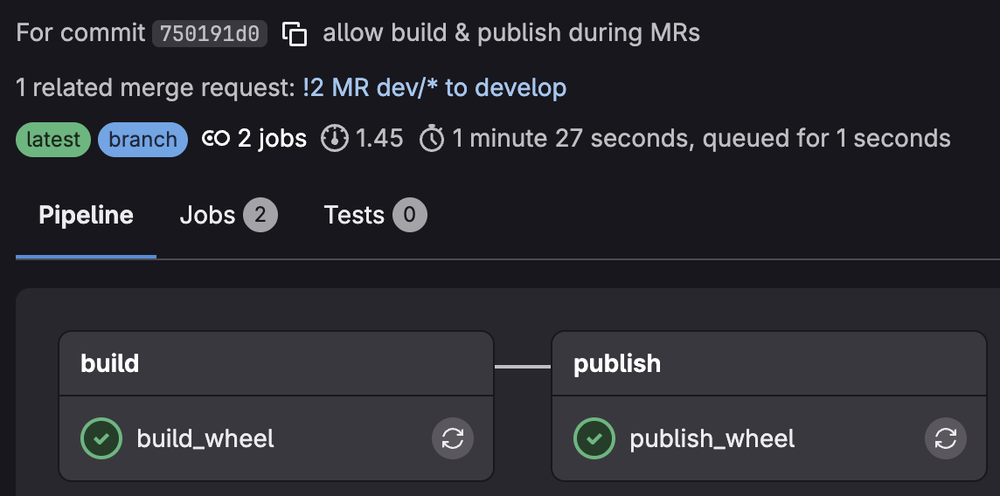
  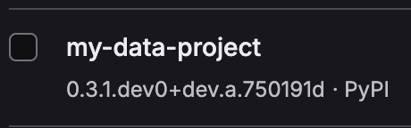
</p>

---

### Step 2 — Merge Request from `dev/a` to `develop`

When a MR is opened, GitLab exposes the **source branch name** to the pipeline. `hatch_build.py` picks it up the same way and resolves the same version: `my_data_project-0.3.1.dev0+dev-a.750191d`.

The build succeeds, but **publish fails** — the package already exists in the registry from Step 1.

> **Known limitation:** GitLab does not allow overwriting an existing package version. To resolve this, one approach would be to attempt a delete before publishing, or to introduce a snapshot mode (e.g. appending a build timestamp to the local version identifier).

<p align="center">
  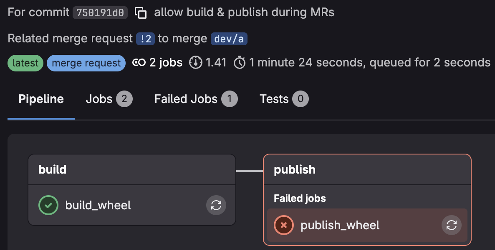
</p>

---

### Step 3 — Post-merge commit on `develop` → RC tag creation

After the MR is merged into `develop`, the `create-tag` job runs. It reads `__version__` from `__init__.py` as the base version (`0.3.1`), scans existing RC tags, and creates the next one.

Since `0.3.1rc1` already existed from a previous test, the job creates `0.3.1rc2`:

```
Develop branch RC release
Base version: 0.3.1
Next RC version (develop): 0.3.1rc2
```

No source file is modified — only an annotated git tag is pushed.

<p align="center">
  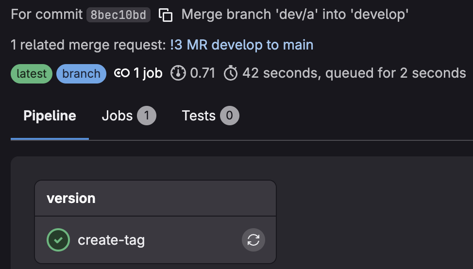
  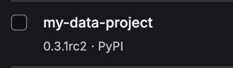
</p>

---

### Step 4 — Tag pipeline triggered by `0.3.1rc2`

Pushing the RC tag automatically triggers a new pipeline. This time `CI_COMMIT_TAG` is set to `0.3.1rc2`, so `hatch_build.py` returns the tag directly as the version.

The wheel `my_data_project-0.3.1rc2` is built, published to the registry, and a GitLab Release is created for this tag.

> **Note:** Creating a GitLab Release for non-`main` tags (RC or dev) is not always recommended. It can clutter the Releases page. Depending on the team's workflow, the `create-release` job could be restricted to `main` tags only.

<p align="center">
  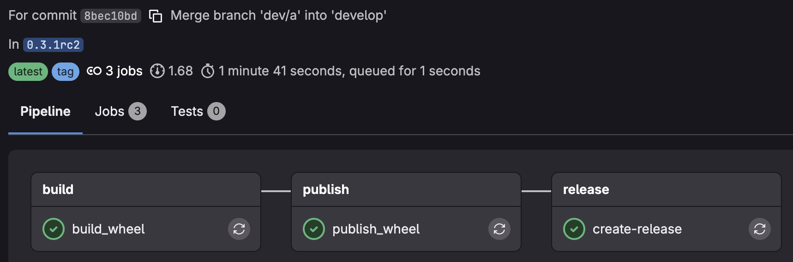
  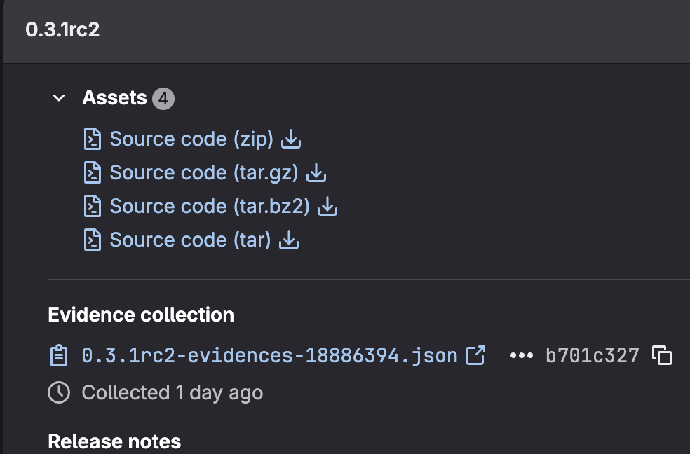
</p>

---

### Step 5 — Merge Request from `develop` to `main`

The MR pipeline behaves the same way as Step 2: GitLab passes the source branch (`develop`) to the pipeline, so `hatch_build.py` resolves the RC version `0.3.1rc2`.

Build succeeds; publish fails because `0.3.1rc2` is already in the registry from Step 4.

<p align="center">
  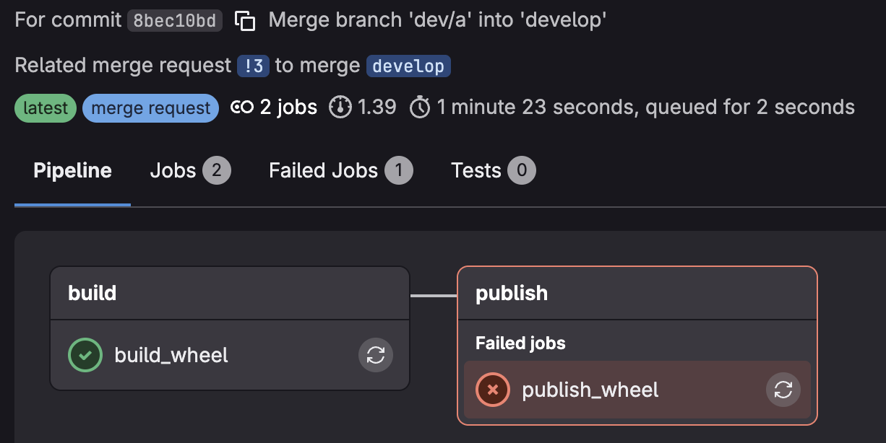
</p>

---

### Step 6 — Post-merge commit on `main` → Commitizen bump

After the MR is merged into `main`, the `create-tag` job runs Commitizen. It inspects the commit messages since the last tag and computes the next semantic version.

> **Important:** For Commitizen to correctly detect the increment, the MR merge commit message must follow the [Conventional Commits](https://www.conventionalcommits.org/) convention (`fix:`, `feat:`, `feat!:` for breaking changes). This should be set when editing the MR title and merge commit message on GitLab.

In this run, a `feat:` commit triggers a **MINOR** bump:

```
Next version (main): 0.4.0
bump: version 0.3.1 → 0.4.0
tag to create: 0.4.0
increment detected: MINOR
[main 8f209e9] bump: version 0.3.1 → 0.4.0
```

<p align="center">
  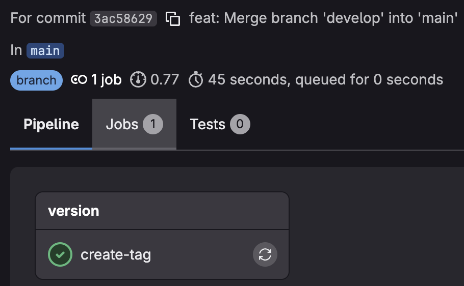
</p>

---

### Step 7 — Bump commit on `main`

Commitizen pushes a commit that updates `__init__.py` and `pyproject.toml` with the new version `0.4.0`. This commit is intentionally excluded from triggering a new pipeline (the `create-tag` job rule filters out messages starting with `bump:`), preventing an infinite loop.

The commit is directly associated with the upcoming `0.4.0` tag:

```
bump: version 0.3.1 → 0.4.0
View commits for tag 0.4.0
```

<p align="center">
  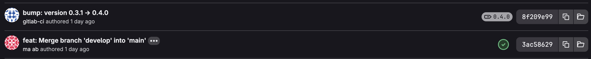
</p>

---

### Step 8 — Tag pipeline triggered by `0.4.0`

The `0.4.0` tag triggers the final pipeline. `CI_COMMIT_TAG` is set, so the wheel is built as `my_data_project-0.4.0`.

It is published to the GitLab Package Registry and a GitLab Release is created for `0.4.0` — the stable production release.

<p align="center">
  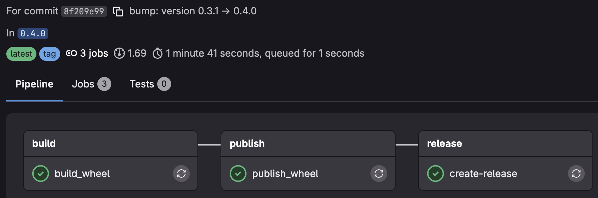
  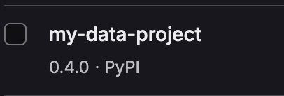
  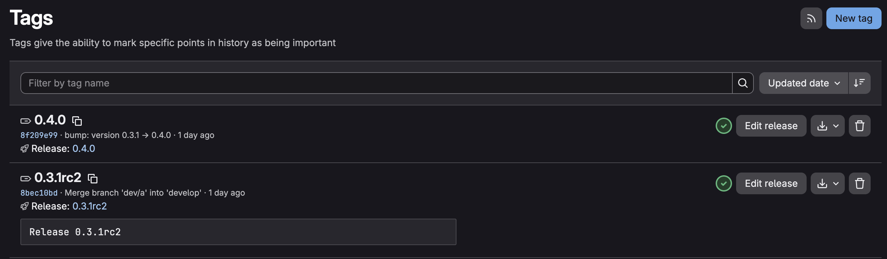
  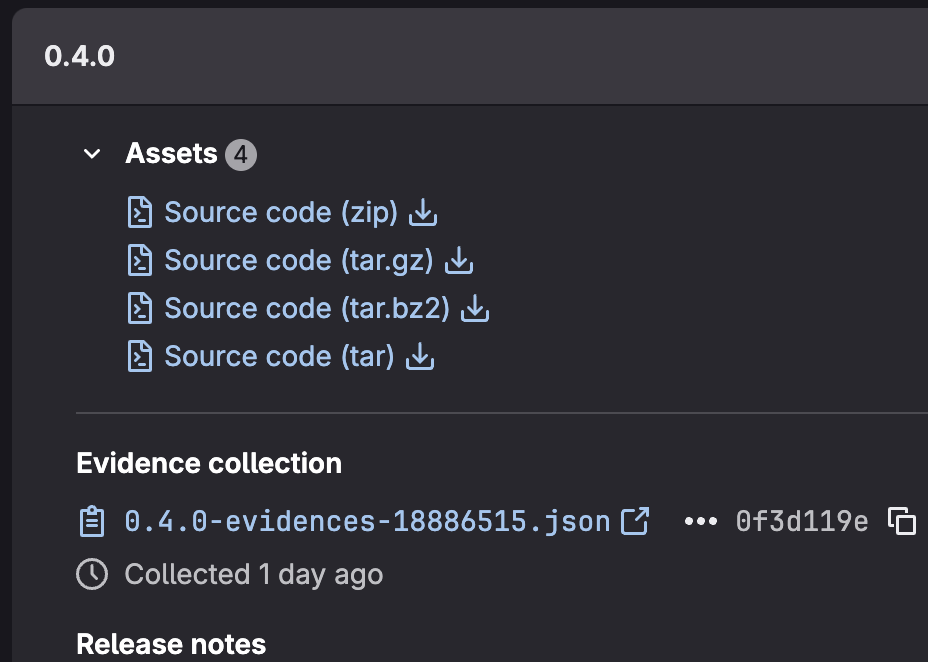
</p>

---

## Configuration files

Detailed explanations of each configuration file are available in their dedicated markdown docs:

- [`pyproject.toml.md`](docs/pyproject.toml.md) — project metadata, build system, Commitizen setup
- [`hatch_build.py.md`](docs/hatch_build.py.md) — dynamic version hook logic
- [`.gitlab-ci.yml.md`](docs/.gitlab-ci.yml.md) — full pipeline breakdown, job rules, and flow diagrams

---

## Tech stack

| Tool | Role |
|---|---|
| [Hatchling](https://hatch.pypa.io/) | Build backend |
| [uv](https://github.com/astral-sh/uv) | Fast Python package manager used in CI |
| [Commitizen](https://commitizen-tools.github.io/commitizen/) | Conventional commits → semver automation |
| [Twine](https://twine.readthedocs.io/) | Wheel upload to package registry |
| GitLab CI/CD | Pipeline orchestration |
| GitLab Package Registry | Private PyPI-compatible package storage |

---

## Known limitations & design notes 
These are things to be aware of, not necessarily to fix.

- The MR publish conflict (Steps 2 & 5) deserves a dedicated note since it's a recurring expected behavior, not a bug. You could explain that it is a structural consequence of GitLab passing the source branch during MR pipelines, and that it is acceptable to ignore the failure at this stage since the package was already published by the branch pipeline. But if it bothers you, three options: delete before upload, append a build counter, or simply skip publish on MR events entirely.
- The RC release note you already have (Step 4) is worth pulling up into a dedicated "design decisions" section — creating releases for RC tags is an intentional choice but one that may not suit all teams.
- Commitizen's dependency on commit message quality is a real operational risk. If a developer merges with a non-conventional message, Commitizen either crashes or defaults to a patch bump. Worth flagging that enforcing this via a GitLab push rule or a pre-receive hook (or a MR title linter in CI) is highly recommended before using this in production.

---

## Improvement suggestions

- Rebase to collect the latest main version on a branch — this is the intended mechanism and worth documenting explicitly. When main gets bumped to 0.4.0 after a release, __init__.py on develop or feature/* still holds 0.3.1 until someone rebases or merges main into the branch. Once they do, __init__.py is updated automatically and all subsequent builds pick up the new base version. No extra tooling needed — it is a natural consequence of the design, but developers need to be aware of it.
- release/* and hotfix/* branch support — currently these branches fall into the catch-all "any other branch" case in both hatch_build.py and the pipeline, so they get a dev0+slug.sha version and no dedicated tagging logic. Two natural additions:
 - release/* branches would benefit from their own RC-like versioning (e.g. 1.2.3rc<N>) independent of develop, useful when you want to stabilize a release without blocking new development on develop.
 - hotfix/* branches targeting main directly should ideally trigger a patch bump on merge, which Commitizen handles naturally as long as the commit message uses fix: — but the create-tag job would need to be extended to run on main after a hotfix merge exactly like a normal main push, which it already does. The gap is more in documentation and team convention than in the pipeline itself.
- Snapshot / always-publish strategy — instead of failing silently on duplicate packages, an improvement would be to always attempt a DELETE on the registry before uploading, or to append a build timestamp as a local version segment (0.3.1.dev0+dev-a.750191d.20240221) to guarantee uniqueness. The tradeoff is registry bloat vs. pipeline reliability.
- Changelog generation — Commitizen supports automatic changelog generation (update_changelog_on_bump = true) which is currently disabled. Enabling it would produce a CHANGELOG.md updated and committed alongside each bump, giving a human-readable release history with no extra effort.
- Protected tags and branch protections — in a production setup, main and the tag namespace should be protected in GitLab so that only the CI bot (CI_PUSH_TOKEN) can push tags, preventing manual tag creation that would break the RC counter logic.